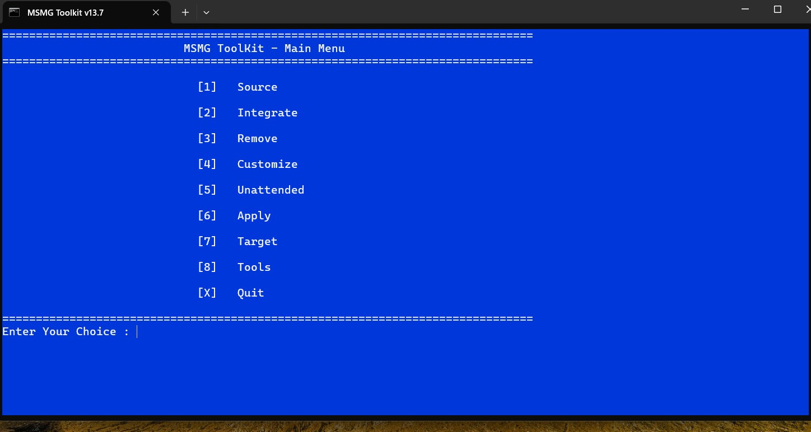
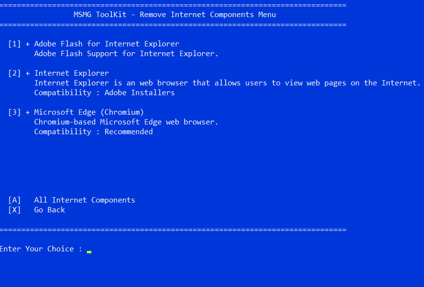

# msmg-custom-iso-guide
Step-by-step guide to create lightweight, customized Windows ISO using MSMG Toolkit

🎯 Goal: Create a lightweight, customized ISO using MSMG Toolkit
🔧 Windows Version: Windows 10 21H2

=== Steps Taken ===

1️⃣ Basic Setup

1) Downloaded Windows 10 21H2 ISO from UUP Dump. (Version: 19044.1263)
  
   Note: Download Took nearly 40-50 mins, on my internet speed of 100 Mbps, so meanwhile
         the ISO downloads, grab a coffee or have a snack ;)
         Also please check the box for incorporating updates on the UUP dump website.
        

   🔴 NOTE: If you choose Win 11 or Win 10 latest ISO, some limitations will be there in debloating/removing components
           of windows, like Edge in 11 or even in 10, you wouldn't be able to take it out because if you do, that will
           break your system/windows, so need to keep that in mind. 

2) Download MSMG Toolkit and extract it.

3) Once the ISO downloads, move it to the ISO folder of the MSMG toolkit folder. 

4) Launch The MSMG Toolkit by clicking on Start batch file.(before launching it, kindly disable your defender/antivirus so that 
                            it doesn't interrupt or slow down the process)
  
   **Note**: The process of downloading, modifying ISO will depend upon your internet speed and your system's config.
         I recommend having:
          $ A good processor like i5 or Ryzen 5 
          $ Min. 8GB of RAM
          $ And your computer should be running on SSD. Please Do not try this on HDD, you will get Frustrated!
            By the time it takes. So keep it in mind if on HDD
         These Specs Ensure that you will get the thing done efficiently without waiting or wasting much time.
   
   SO LET'S GET STARTED!!!

2️⃣ MSMG TOOLKIT:

1) Press 1 to select 'Source'

2) Press 3 to select 'Extract source from DVD ISO image'

3) Enter the ISO file name. (if the ISO file name is random i.e very long due to MS naming, just rename it first then enter
                             or you can just copy paste the name)

4) Then again select source, now select source from DVD folder
   Then select the image you want, here i only downloaded windows 10 pro.
   Press Y to mount Boot and Recovery images.
   
5) After this, select Remove on home page
   select remove components
  select 'Select Windows components'

6) Now here are a lot of options
   O1) Internet
        Here we are having two options, IE and Edge 
        Let's remove both
      
	 **Note**: Edge gets reinstalled during OOBE, if connected to the Internet
   
   O2) Multimedia
       	Here 13 Options, remove the ones which you don't need.
      	(See screenshot)
   
   O3) Network
       	Just do what I did. Only remove other components if you know what you're doing.
       	What I removed are needless bloatware for a home user.(Screenshot)

   O4) Privacy
       	Yes, Privacy also has some bloatware.

     **Note**: If your device supports windows Hello face you can keep it, 
           same if you like picture password, you can keep it.
           For more info you can see the screenshot for respective info 
           of the options and further you can google them also.
             
      **!! Removing Telemetry is a must, MS Collects data without our knowledge and permission. !!**

   O5) Remoting
       	Just Remove everything.
   
   O6) System
        Here remove ease of access if you want,
        also you can remove file history, i am not removing it as it could be useful
      	Remove Storage spaces, steps recorder, WSL ,Windows to Go (Don't remove something if useful)
      	You can also remove wordpad, i am not removing it.
    
   O7) System Apps:
         Here I removed the Following Items:
           Eye Control
	         Map Control
	         Edge (Legacy) (Remove to ensure Edge doesn't get reinstalled)
	         Edge Dev tools client
	         Family Features
	         Quick Assist
	         Retail Demo
           Skype ORTC
	         Take a Test
	         Windows Barcode Preview
	         WMR
	         Windows Reader (PDF)
	         Shell Experience (!! Caution: This can break the windows !!)
	         Xbox Game Callable UI

      You can keep or remove more based upon your requirements

   O8) Windows Apps:
        Cortana
	      Your Phone
	      Xbox Related Everything
	      Weather
	      Tips
	      Sticky Notes
	      Skype
	      Paint 3D
	      Office
	      OneNote
	      Mail and Calendar
	      Groove Music
	      Get Help
	      Feedback Hub

8) After This, go back and select 'start Removing Windows Components'
    This will take time, so grab a coffee or have a snack ;)
       Note: Press Enter if it looks stuck

9) Go back to main menu, select apply, and select apply changes to source image

10) Go back to Main menu, choose Target, Make DVD ISO image.

10)Check the new made ISO inside the ISO Folder

Note: You can also integrate drivers, apps, and many more things. Just google it or try it yourself and break the windows ;)

3️⃣ Installing

1) If you Want to install this ISO on a system, use rufus for flashing.

     Just Download Rufus, Select the ISO, and flash it into a Flash Drive.

     For Win 11:     
	        When you click start, A DIALOG box can open where it can ask for removing min specs. requirements
	        like 4gb ram, TPM 2.0 etc. , for your own convenience leave it as it is. and continue to flash the ISO.

2) I am installing on a VM, so if you want to try it out first, then try it on a VM.

     VM config: 4096 MB RAM
                Allocated 50 GB Storage
                Allocated 4 Cores of my processor 

     Note: In OOBE, when you get those toggles of services like Location, diagnostic data
           always, ALWAYS keep them off, Telemetry is always a NO, we should have the control over our data.

     Result:
             1.3-1.4 GB Ram usage
             System felt very snappy and responsive.
             CPU's Processes reduced to 110-120

4️⃣Conclusion

   That's it!
   This is your go-to-guide for creating your own Win 10 or 11 ISO
   I hope you liked it.
   See ya :))
